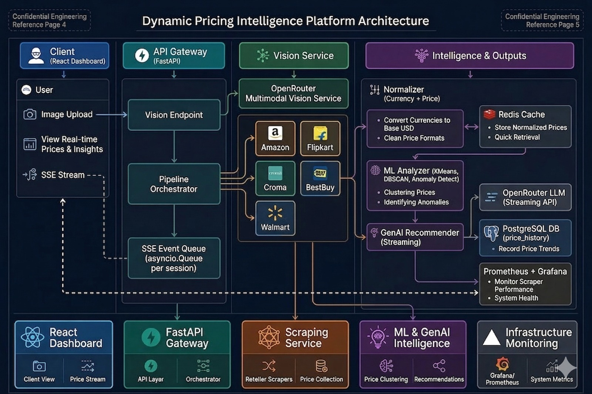

# Synycs Dynamic Pricing Intelligence Platform

A state-of-the-art, fully autonomous microservice pipeline that evaluates real-time market viability. This platform uses Playwright/HTTPX evasion scraping, isolates optimal market positions using unsupervised Machine Learning, and produces deep analytical reports powered by Generative AI.

---

## 🏗️ High-Level Component Structure

Below is the directory architecture detailing how responsibilities are decoupled across independent microservices:

```text
Synycs_Dynamic_Pricing/
│
├── run.py                 # Multi-App Uvicorn Entrypoint
├── .env                   # Global Configuration (API Keys, Postgres URLs)
│
├── api_gateway/           # Core Orchestrator
│   ├── main.py            # FastAPI Application / Routes
│   ├── orchestrator.py    # Multi-Scraper Session Executor
│   └── db.py              # PostgreSQL / TimescaleDB Database Insertion Functions
│
├── frontend/              # Live Observability Dashboard
│   ├── src/App.tsx        # React Vite Application Entry
│   ├── tailwind.config.js # Typography and Formatting definitions
│   └── package.json       # React, Recharts, and React-Markdown dependencies
│
├── scraping-service/      # Bypass Extraction Engines
│   ├── scrapers/          # Vendor-specific algorithms (Flipkart, Amazon, Walmart, Bestbuy, Croma)
│   ├── headers.py         # Mobile/Desktop User-Agent rotation
│   └── playwright_utils.py# Headless browser configuration / Stealth modes
│
├── ml-service/            # Quantitative Data Engine
│   ├── analyser.py        # DBSCAN / KMeans Clustering Models
│   └── demand.py          # Elasticity and review confidence scoring
│
├── genai-service/         # Strategic Text Generation
│   └── generator.py       # Prompt Engineering logic connected to OpenRouter models
│
└── vision-service/        # Initial Payload Generation
    └── app.py             # Vision AI extraction of baseline models/colors from user images
```

---



---

## 🚀 Execution Pseudo-Code Flow

The entire multi-layer application operates autonomously when a User uploads an image via the Frontend. Here is the exact logical pipeline governing data movement:

```pseudo
START SESSION:
  1. USER uploads an Image from the Frontend Dashboard
  
  // Phase 1: Identity Extraction
  2. ROUTE TO vision-service -> POST /identify
     a. Query OpenRouter Vision Model
     b. Receive standardized Output: { "product": "Samsung Galaxy S24 FE", "details": ... }

  // Phase 2: Live Competitive Scraping
  3. ROUTE TO api_gateway -> orchestrator.run_all_scrapers(product)
     a. IN PARALLEL, query scraping-service endpoints (Amazon, Flipkart, etc...)
     b. FOR TARGET IN scrapers:
          IF WAF Blocked (403):
              Attempt Fallback Strategy (Mobile Headers / Playwright)
          IF Found HTML:
              Extract Title, Price (fallback to robust Regex)
              Calculate FuzzyMatch(Title)
          YIELD status to Frontend via Server-Sent-Events (SSE)

  // Phase 3: Analytical Optimization
  4. ROUTE TO ml-service -> analyser.analyse_prices(found_prices)
     a. Filter statistical outliers using IsolationForest
     b. Run K-Means Clustering on valid prices
     c. Compare Average, Variance, and determine Optimal Pricing Strategy (e.g. "Competitive Undercut")
     d. Output Numerical Targets -> ml_optimization_data

  // Phase 4: Strategy Generation
  5. ROUTE TO genai-service -> generator.generate_report(ml_optimization_data)
     a. Pass optimized market targets to large language model
     b. Prompt model to explain margins, bottom-line, and risks
     c. Receive heavily styled Markdown output (Intelligence Report)

  // Phase 5: Persistence
  6. EXECUTE api_gateway -> db.insert_session_results()
     a. Write Vision Identity + Competitor Scores + ML Targets + GenAI text into PostgreSQL
     
  7. Frontend renders Final React Markdown and Charts
END SESSION
```

---

## 🛠️ Microservice Details & Protocols

### 1. The React Observability Dashboard (`/frontend`)
Instead of a standard CRUD interface, this UI behaves strictly as an Operations Dashboard. 
- Uses **Server-Sent Events (SSE)** to stream live ping/failure traces from scrapers.
- Renders final Intelligence Report using `react-markdown` with GFM (GitHub Flavored Markdown) and Tailwind Typography plugins for flawless rendering of Strategy Tables.

### 2. The API Gateway (`/api_gateway`)
This FastAPI application unifies the system. It exposes synchronous endpoints (`/vision`, `/history`) and the massive asynchronous pipeline (`/scrape`). It is the absolute source of truth prior to executing PostgreSQL transactions (`db.py`).

### 3. The Scraping Service (`/scraping-service`)
Engineered to bypass commercial WAFs (Akamai, PerimeterX).
- Operates primarily via rapid `httpx` logic masquerading as high-tier Smartphone network requests.
- Implements deep fallback mechanisms for asynchronous Playwright execution if rigorous payload verification is required.

### 4. The ML Engine (`/ml-service`)
Evaluates raw arrays of pricing dynamically. Uses `sklearn` configurations to detect anomalies natively. Capable of dropping its source-count logic seamlessly to handle sparse market responses.

### 5. OpenRouter Integration (`/genai-service` & `/vision-service`)
All Artificial Intelligence layers are separated logically. Vision acts as the entrypoint (User Intention), while GenAI acts as the exit point (Strategic Translation).

---

## 💻 Run Instructions

**1. Launch the Backend Gateway**
From the root directory, executed via Uvicorn hot-reload:
```bash
python run.py
```

**2. Launch the Frontend Application**
In a separate terminal:
```bash
cd frontend
npm run dev
```
